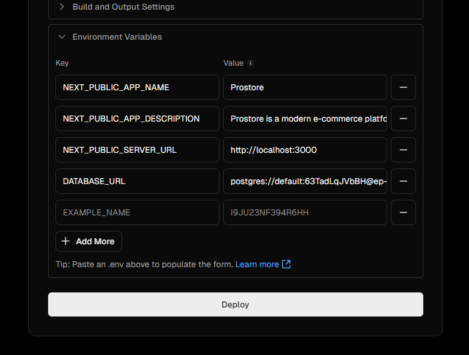

# Initial Deployment

Now we are going to make our initial deployment to Vercel.

## Create a GitHub Repository

Before we deploy to Vercel, we need to create a Github repo if you don't already have one. Make sure that you have Git installed on your machine with `git --version`. If you don't have Git installed, you can download it from [here](https://git-scm.com/downloads) or install it with your package manager.

Once you have Git installed, you can create a new repository by running the following command in your terminal:

```bash
git init
```

In your `/gitignore` file, make sure that you have the `.env` file listed. You don't want to commit this file to your repository.

This will create a new Git repository in the current directory. You can then add all of the files in the directory to the repository by running the following command:

```bash
git add .
```

You can then commit the changes to the repository by running the following command:

```bash
git commit -m "Initial commit"
```

Now go to [GitHub](https://github.com/) and create a new repository. You can name it whatever you want. Once you have created the repository, you can add the remote repository to your local repository by running the following command:

```bash
git remote add origin <your-repository-url>
```

use the `main` branch as the default branch:

```bash
git branch -M main
```

You can then push the changes to the remote repository by running the following command:

```bash
git push -u origin main
```

## Vercel

We will be deploying the project to Vercel. Make sure that you create a Vercel account and sign in. You can sign in with your GitHub account.

Once you are signed in, click on "Add New" and then "Project".

Select the repository that you just created and click "Import".

Click on the "Environment Variables" tab. Copy all of the code in your `.env` file and paste it into the "Environment Variables" section. This will allow you to use the environment variables in your Vercel project.



Click on "Deploy".

Once it's done, you should be able to go to the URL that Vercel gives you and see the project.

If you get any errors that show something about dependencies, then go to the "Build & Output" settings where it says "Install Command" and add the following:

```
npm install --legacy-peer-deps
```

Then try again

## Update the Server URL

Now that we have deployed the project, we need to update the `SERVER_URL` in the `.env` file to the URL that Vercel gives you. This will allow the project to work correctly.

Our initial deployment is complete! What is great is when you push to your repository, Vercel will automatically deploy the project. So we are pretty much all set as far as that goes.

If you had any issues, be sure to check the logs in Vercel to see what went wrong.
