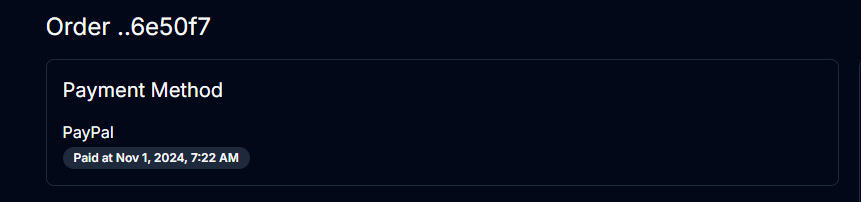

# Implement Paypal Button

We have the backend functionality done to take PayPal payments, but we need to implement the PayPal button and the UI.

We are going to use a package called `@paypal/react-paypal-js` to implement the PayPal button. Let's install it:

```bash
npm install @paypal/react-paypal-js
```

Now let's open the `app/(root)/order/[id]/order-details.form.tsx` file.

Add the following imports:

```tsx
import {
  PayPalButtons,
  PayPalScriptProvider,
  usePayPalScriptReducer,
} from '@paypal/react-paypal-js';
```

Here is an overview of what these are:

- `PayPalButtons`: This is the component that will render the PayPal button.
- `PayPalScriptProvider`: This is the component that will load the PayPal script. It ensures the SDK is loaded before any buttons or PayPal features are rendered.
- `usePayPalScriptReducer`: This is a custom React hook that provides access to the state of the PayPal script. It allows you to dynamically control the loading state and settings of the PayPal SDK, which can be useful if you need to adjust configuration or show loading indicators while the SDK is being prepared.

We also want to import the 2 actions from the `order.actions.ts` file:

```tsx
import {
  approvePayPalOrder,
  createPayPalOrder,
} from '@/lib/actions/order.actions';
```

## Pass In The PayPal Client ID

This component will take the client ID as a prop. Open the file where it is embedded, which is the `app/(root)/order/[id]/page.tsx` file and add the following:

```tsx
return (
  <OrderDetailsTable
    order={{
      ...order,
      shippingAddress: order.shippingAddress as ShippingAddress,
    }}
    paypalClientId={process.env.PAYPAL_CLIENT_ID || 'sb'}
  />
);
```

We are passing the PayPal client ID as a prop to the `OrderDetailsTable` component.

Now add it as a prop to the `OrderDetailsTable` component:

```tsx
const OrderDetailsTable = ({
  order,
  paypalClientId,
}: {
  order: Order;
  paypalClientId: string;
}) => {};
```

Right above the return, add the following code:

```tsx
// Checks the loading status of the PayPal script
function PrintLoadingState() {
  const [{ isPending, isRejected }] = usePayPalScriptReducer();
  let status = '';
  if (isPending) {
    status = 'Loading PayPal...';
  } else if (isRejected) {
    status = 'Error in loading PayPal.';
  }
  return status;
}
```

This code checks the loading status of the PayPal script and returns a status message.

Next, add the following function under the `PrintLoadingState` function:

```tsx
// Creates a PayPal order
const handleCreatePayPalOrder = async () => {
  const res = await createPayPalOrder(order.id);
  if (!res.success)
    return toast({
      description: res.message,
      variant: 'destructive',
    });
  return res.data;
};
```

This calls our `createPayPalOrder` action and returns the response.

Finally, we need a function to call the approvePayPalOrder action:

```tsx
// Approves a PayPal order
const handleApprovePayPalOrder = async (data: { orderID: string }) => {
  const res = await approvePayPalOrder(order.id, data);
  toast({
    description: res.message,
    variant: res.success ? 'default' : 'destructive',
  });
};
```

Now, down at the bottom, right above the closing `</CardContent>` tag, add the following:

```tsx
{
  /* PayPal Payment */
}
{
  !isPaid && paymentMethod === 'PayPal' && (
    <div>
      <PayPalScriptProvider options={{ clientId: paypalClientId }}>
        <PrintLoadingState />
        <PayPalButtons
          createOrder={handleCreatePayPalOrder}
          onApprove={handleApprovePayPalOrder}
        />
      </PayPalScriptProvider>
    </div>
  );
}
```

We are checking to see if the order is paid. If it is not and the payment method is PayPal, we will render the PayPal button. THe button takes in the `createOrder` and `onApprove` props.

## Test It Out

Now click the pay with paypal button and use your sandbox account. There is no way to use real money while in sandbox mode so don't worry about that.

One paid, you will be redirected to the order details page and you will see the order status as paid.



That's it! You have successfully implemented the PayPal button.
