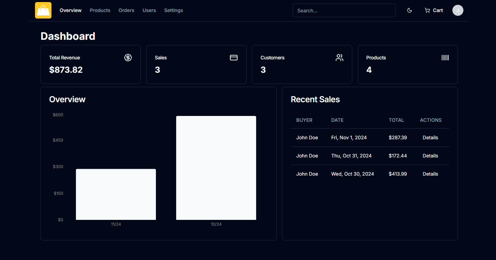

# Monthly Sales Chart

Now we are going to create the monthly sales chart on the admin overview page.

First, we need to install Recharts. Open a terminal and type the following:

```bash
npm install recharts
```

Now create a file at `app/admin/overview/charts.tsx` and add the following code:

```tsx
'use client';

import { Bar, BarChart, ResponsiveContainer, XAxis, YAxis } from 'recharts';

const Charts = ({
  data: { salesData },
}: {
  data: { salesData: { month: string; totalSales: number }[] };
}) => {
  return (
    <ResponsiveContainer width='100%' height={350}>
      <BarChart data={salesData}>
        <XAxis
          dataKey='month'
          stroke='#888888'
          fontSize={12}
          tickLine={false}
          axisLine={false}
        />
        <YAxis
          stroke='#888888'
          fontSize={12}
          tickLine={false}
          axisLine={false}
          tickFormatter={(value) => `$${value}`}
        />
        <Bar
          dataKey='totalSales'
          fill='currentColor'
          radius={[4, 4, 0, 0]}
          className='fill-primary'
        />
      </BarChart>
    </ResponsiveContainer>
  );
};

export default Charts;
```

What we are doing is taking in the sales data from the action function and passing it to the chart. We are also using the `ResponsiveContainer` component to make the chart responsive. We are using the `BarChart` component to create the chart. We are using the `XAxis` and `YAxis` components to create the x and y axis. Finally, we are using the `Bar` component to create the bars in the chart.

## Showing The Chart

Now go to the `app/admin/overview/page.tsx` file and import the `Charts` component:

```tsx
import Charts from './charts';

```

Now add it in the card and pass in the sales data:

```tsx
      <div className='grid gap-4 md:grid-cols-2 lg:grid-cols-7'>
        <Card className='col-span-4'>
          <CardHeader>
            <CardTitle>Overview</CardTitle>
          </CardHeader>
          <CardContent className='pl-2'>
            <Charts
              data={{
                salesData: summary.salesData,
              }}
            />
          </CardContent>
        </Card>
        //..
      </div>
```

Your dashboard should look like this:



Let's move on the the admin orders.
