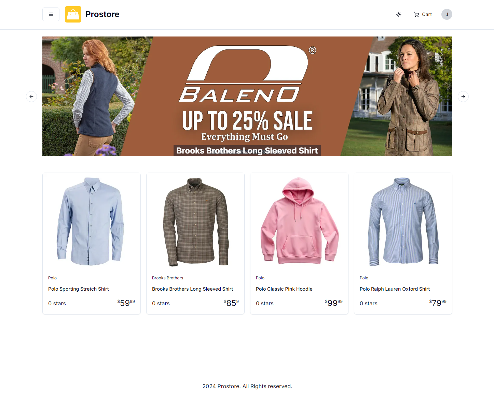

# Featured Products Carousel

We are going to add a carousel on the homepage that will show the featured products and their banners.

## Carousel Component & Autoplay Plugin

We are going to use the ShadCN Carousel component and the Embla Carousel Autoplay plugin so that it plays automatically when you visit the page.

```bash
npx shadcn@latest add carousel
npm install embla-carousel-autoplay
```

## Featured Products Action

We need to create an action that will get the featured products. Open the `lib/actions/product.actions.ts` file and add the following function:

```ts
// Get featured products
export async function getFeaturedProducts() {
  const data = await prisma.product.findMany({
    where: { isFeatured: true },
    orderBy: { createdAt: 'desc' },
    take: 4,
  });

  return convertToPlainObject(data);
}
```

## Carousel Component

Create a new file at `components/shared/product/product-carousel.tsx` and add the following code:

```tsx
'use client';

import Autoplay from 'embla-carousel-autoplay';
import {
  Carousel,
  CarouselContent,
  CarouselItem,
  CarouselNext,
  CarouselPrevious,
} from '@/components/ui/carousel';
import { Product } from '@/types';
import Link from 'next/link';
import Image from 'next/image';

export function ProductCarousel({ data }: { data: Product[] }) {
  return (
    <Carousel
      className='w-full mb-12'
      opts={{
        loop: true,
      }}
      plugins={[
        Autoplay({
          delay: 2000,
          stopOnInteraction: true,
          stopOnMouseEnter: true,
        }),
      ]}
    >
      <CarouselContent>
        {data.map((product: Product) => (
          <CarouselItem key={product.id}>
            <Link href={`/product/${product.slug}`}>
              <div className='relative   mx-auto  '>
                <Image
                  alt={product.name}
                  src={product.banner!}
                  width='0'
                  height='0'
                  sizes='100vw'
                  className='w-full h-auto'
                />
                <div className='absolute inset-0 flex items-end justify-center'>
                  <h2 className=' bg-gray-900 bg-opacity-50 text-2xl font-bold px-2 text-white  '>
                    {product.name}
                  </h2>
                </div>
              </div>
            </Link>
          </CarouselItem>
        ))}
      </CarouselContent>
      <CarouselPrevious />
      <CarouselNext />
    </Carousel>
  );
}
```

Let's go over this code.

We are bringing in the `Carousel` component from the ShadCN library. We are also bringing in the `Autoplay` plugin from the `embla-carousel-autoplay` library. We are also bringing in the `Product` type from the `types.ts` file.

The component takes in a data prop. We set the `Carousel` component with an option of `loop: true` and plugins of `Autoplay`. We are also mapping over the data and rendering a `CarouselItem` for each product. We are also rendering a `CarouselPrevious` and `CarouselNext` component.

Let's bring in both the action and the component into the `app/(root)/page.tsx` file.

```tsx
import {
  getFeaturedProducts,
  getLatestProducts,
} from '@/lib/actions/product.actions';
import ProductCarousel from '@/components/shared/product/product-carousel';
```

Then get the featured products. Add this above the return statement:

```tsx
const featuredProducts = await getFeaturedProducts();
```

Now in the return, check if there are any featured products. If there are, render the `ProductCarousel` component.

```tsx
return (
  <div>
    {featuredProducts.length > 0 && <ProductCarousel data={featuredProducts} />}

    <ProductList title='Newest Arrivals' data={latestProducts} />
  </div>
);
```

Now you should see the carousel on the homepage.


