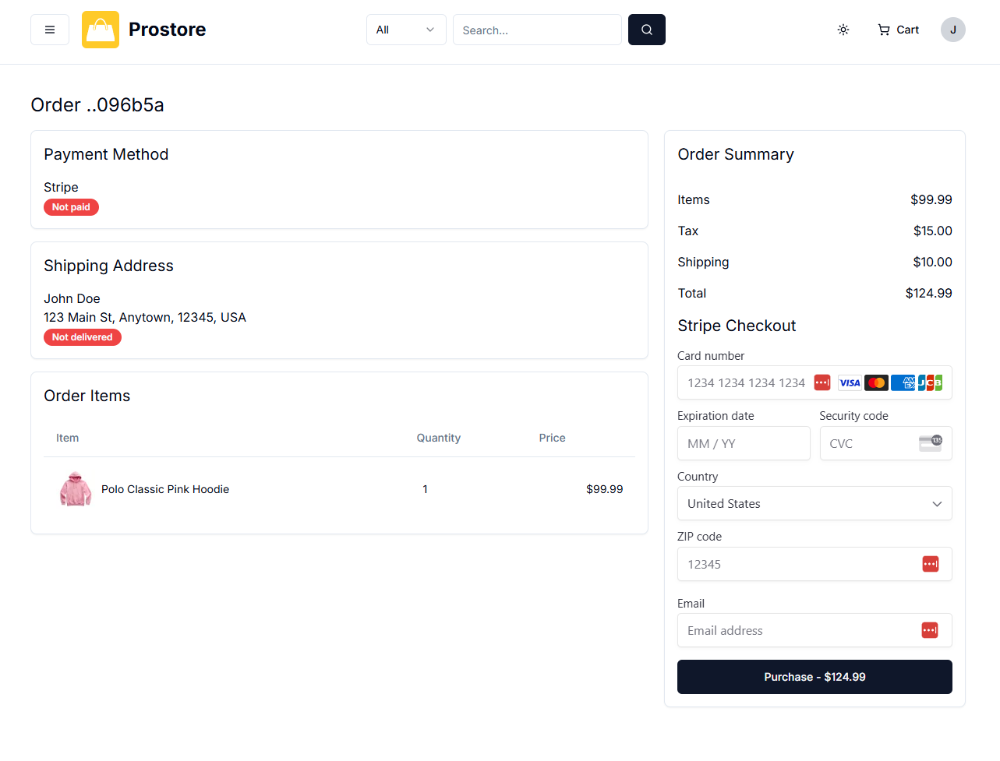

# Stripe Payment Component

In the last lesson, we created the StripePayment component and just returned a placeholder for now. In this lesson, we will create the actual Stripe form.

Open the file `app/(root)/order/[id]/stripe-payment.tsx` and add the following imports:

```tsx
import { Button } from '@/components/ui/button';
import { SERVER_URL } from '@/lib/constants';
import { formatCurrency } from '@/lib/utils';
import {
  Elements,
  LinkAuthenticationElement,
  PaymentElement,
  useElements,
  useStripe,
} from '@stripe/react-stripe-js';
import { loadStripe } from '@stripe/stripe-js/pure';
import { useTheme } from 'next-themes';
import { FormEvent, useState } from 'react';

const StripePayment = ({
  priceInCents,
  orderId,
  clientSecret,
}: {
  priceInCents: number;
  orderId: string;
  clientSecret: string;
}) => {
  return <>STRIPE FORM</>;
};

export default StripePayment;
```

As you can see, we are using quite a few components from the React Stripe library. The `Elements` component is used to wrap the entire payment form and provide the Stripe context to the child components. The `LinkAuthenticationElement` is used to collect the customer's email address and phone number. The `PaymentElement` is used to collect the payment details. The `useElements` and `useStripe` hooks are used to access the Stripe context and the Stripe instance.

Then we have the `loadStripe` function from the Stripe library. This will initialize and configure Stripe within the app. It sets up Stripe’s client SDK by asynchronously loading the Stripe.js library and creating an instance that interacts with Stripe's API.

@stripe/stripe-js is the official Stripe JavaScript library, which provides tools like loadStripe to help set up and use Stripe in web applications. `/pure` is a special entry point in this library that is side-effect-free. Which means it doesn't automatically modify global variables or state upon import, which makes it safer for environments that depend on strict module isolation (such as server-side rendering). If you were building a SPA, you would most likely use the regular `loadStripe` function from the `@stripe/stripe-js` without the `/pure` suffix.

The `useTheme` hook is used to get the current theme from the `next-themes` package. The reason we are using this is because we want to use the Stripe payment form in both light and dark mode. If we didn't use this, then the payment form would be in the wrong color scheme.

We need to call the `loadStripe` function, which returns a promise that resolves to an instance of the Stripe object, which allows interaction with Stripe’s API. It needs to be passed the publishable key from the `.env` file.

Add the following code above the return of the `StripePayment` function:

```tsx
const stripePromise = loadStripe(
  process.env.NEXT_PUBLIC_STRIPE_PUBLISHABLE_KEY as string
);

const { theme, systemTheme } = useTheme();
```

We are putting the returned promise in a variable called `stripePromise` so that we can use it later in the component. We also initialized the `useTheme` hook to get the current theme and the system theme.

## StripeForm Component

We are going to have a nested component called `StripeForm` that will handle the form submission and payment processing. This will be passed into the `StripePayment` component, which will return an `Elements` component from the `@stripe/react-stripe-js` package. I know it's a bit confusing.

So add the `StripeForm` function within the `StripePayment` component like this:

```tsx
const StripePayment = ({
  priceInCents,
  orderId,
  clientSecret,
}: {
  priceInCents: number;
  orderId: string;
  clientSecret: string;
}) => {
  const stripePromise = loadStripe(
    process.env.NEXT_PUBLIC_STRIPE_PUBLISHABLE_KEY as string
  );
  const { theme, systemTheme } = useTheme();

  // Stripe Form Component
  const StripeForm = () => {
    // return for StripeForm
    return <>STRIPE FORM</>;
  };

  // Return for StripePayment
  return <>STRIPE FORM</>;
};

export default StripePayment;
```

Now, within the `StripeForm` function, we are going to initialize the Stripe instance and the Elements instance. We are also going to initialize the loading state, error message, and email address.

```tsx
// Stripe Form Component
const StripeForm = () => {
  const stripe = useStripe();
  const elements = useElements();

  const [isLoading, setIsLoading] = useState(false);
  const [errorMessage, setErrorMessage] = useState<string>();
  const [email, setEmail] = useState<string>();

  // return for StripeForm
  return <>STRIPE FORM</>;
};
```

We are using the `useStripe` and `useElements` hooks to get the Stripe instance and the Elements instance. We are also using the `useState` hook to manage the loading state, error message, and email address.

Now let's add the return for the `StriptForm` component.

```tsx
return (
  <form onSubmit={handleSubmit} className='space-y-4'>
    <div className='text-xl'>Stripe Checkout</div>
    {errorMessage && <div className='text-destructive'>{errorMessage}</div>}
    <PaymentElement />
    <div>
      <LinkAuthenticationElement onChange={(e) => setEmail(e.value.email)} />
    </div>
    <Button
      className='w-full'
      size='lg'
      disabled={stripe == null || elements == null || isLoading}
    >
      {isLoading
        ? 'Purchasing...'
        : `Purchase - ${formatCurrency(priceInCents / 100)}`}
    </Button>
  </form>
);
```

We are using the `PaymentElement` component from the `@stripe/react-stripe-js` package. This is the form that will be displayed to the user. This component is a pre-built UI element from Stripe that displays the payment input fields (like card details). We don't manually create these form inputs. The `PaymentElement` component automatically adapts to the Payment Intent and configured payment methods, handling sensitive information securely without the developer needing to build custom input fields.

We are also using the `LinkAuthenticationElement` component from the `@stripe/react-stripe-js` package. This is another Stripe UI component that allows users to enter their email. If they’re using Stripe Link (a feature that lets users save their payment details), this email input can help recognize returning customers. The `onChange` prop just sets the `email` state.

Then we just have a button that will submit the form.

We are using the `handleSubmit` function to handle the submission. So we need to create that.

Add the the following above the return statement of the `StripeForm` function:

```tsx
// Handle StripeForm submission
async function handleSubmit(e: FormEvent) {
  e.preventDefault();
  if (stripe == null || elements == null || email == null) return;
  setIsLoading(true);
 stripe
  .confirmPayment({
    elements,
    confirmParams: {
      return_url: `${SERVER_URL}/order/${orderId}/stripe-payment-success`,
    },
  })
  .then(({ error }) => {
    if (error?.type === 'card_error' || error?.type === 'validation_error') {
      setErrorMessage(error?.message ?? 'An unknown error occurred.');
    } else if (error) {
      setErrorMessage('An unknown error occurred.');
    }
  })
  .finally(() => setIsLoading(false));

}
```

We are using the `confirmPayment` method from the `stripe` instance to confirm the payment. We are also using the `confirmParams` object to set the return URL for the payment. The user will be sent to the return URL after the payment is completed. This means that we need to create a route that will handle the payment success.

We are using the `then` method to handle the response from the `confirmPayment` method. We are using the `finally` method to set the loading state to false.

## `StripePayment` Component Return

This component will return an `<Elements>` component from the `@stripe/react-stripe-js` package and it will take in the `stripePromise` as a prop and wrap the `StripeForm` component.

Add the following for the return statement of the `StripePayment` component:

```tsx
// Return for StripePayment
return (
  <Elements
    options={{
      clientSecret,
      appearance: {
        theme:
          theme === 'dark'
            ? 'night'
            : theme === 'light'
            ? 'stripe'
            : systemTheme === 'light'
            ? 'stripe'
            : 'night',
      },
    }}
    stripe={stripePromise}
  >
    <StripeForm />
  </Elements>
);
```

We are also setting the theme based on the theme and system theme. This will allow us to use the Stripe theme and the Stripe night theme.

Now you should see the form. It should look like this:



## Test The Stripe Form

Make sure you are in test mode and then try the form using the following test card details:

- Card Number: 4242 4242 4242 4242
- Expiry Date: 12/34
- CVC: 123
- ZIP: ANy 5 digit code

You should be redurected to the success page, which does not exist yet but your URL should look something like this:

```
http://localhost:3000/order/5e89889a-3ab7-4e53-9054-5df781096b5a/stripe-payment-success?payment_intent=pi_3QJarmG87GyT6H7X18ovawi4&payment_intent_client_secret=pi_3QJarmG87GyT6H7X18ovawi4_secret_jANMWjEUy8cQZsMvCHDqQOyEp&redirect_status=succeeded
```

Here is the complete code for the `StripePayment` component:

```tsx
import { Button } from '@/components/ui/button';
import { SERVER_URL } from '@/lib/constants';
import { formatCurrency } from '@/lib/utils';
import {
  Elements,
  LinkAuthenticationElement,
  PaymentElement,
  useElements,
  useStripe,
} from '@stripe/react-stripe-js';
import { loadStripe } from '@stripe/stripe-js/pure';
import { useTheme } from 'next-themes';
import { FormEvent, useState } from 'react';

const StripePayment = ({
  priceInCents,
  orderId,
  clientSecret,
}: {
  priceInCents: number;
  orderId: string;
  clientSecret: string;
}) => {
  const stripePromise = loadStripe(
    process.env.NEXT_PUBLIC_STRIPE_PUBLISHABLE_KEY as string
  );
  const { theme, systemTheme } = useTheme();

  // Stripe Form Component
  const StripeForm = () => {
    const stripe = useStripe();
    const elements = useElements();

    const [isLoading, setIsLoading] = useState(false);
    const [errorMessage, setErrorMessage] = useState<string>();
    const [email, setEmail] = useState<string>();

    // Handle StripeForm submission
    async function handleSubmit(e: FormEvent) {
      e.preventDefault();
      if (stripe == null || elements == null || email == null) return;
      setIsLoading(true);
      stripe
        .confirmPayment({
          elements,
          confirmParams: {
            return_url: `${SERVER_URL}/order/${orderId}/stripe-payment-success`,
          },
        })
        .then(({ error }) => {
          if (
            error.type === 'card_error' ||
            error.type === 'validation_error'
          ) {
            setErrorMessage(error.message);
          } else {
            setErrorMessage('An unknown error occurred');
          }
        })
        .finally(() => setIsLoading(false));
    }

    // return for StripeForm
    return (
      <form onSubmit={handleSubmit} className='space-y-4'>
        <div className='text-xl'>Stripe Checkout</div>
        {errorMessage && <div className='text-destructive'>{errorMessage}</div>}
        <PaymentElement />
        <div>
          <LinkAuthenticationElement
            onChange={(e) => setEmail(e.value.email)}
          />
        </div>
        <Button
          className='w-full'
          size='lg'
          disabled={stripe == null || elements == null || isLoading}
        >
          {isLoading
            ? 'Purchasing...'
            : `Purchase - ${formatCurrency(priceInCents / 100)}`}
        </Button>
      </form>
    );
  };

  // Return for StripePayment
  return (
    <Elements
      options={{
        clientSecret,
        appearance: {
          theme:
            theme === 'dark'
              ? 'night'
              : theme === 'light'
              ? 'stripe'
              : systemTheme === 'light'
              ? 'stripe'
              : 'night',
        },
      }}
      stripe={stripePromise}
    >
      <StripeForm />
    </Elements>
  );
};

export default StripePayment;
```
